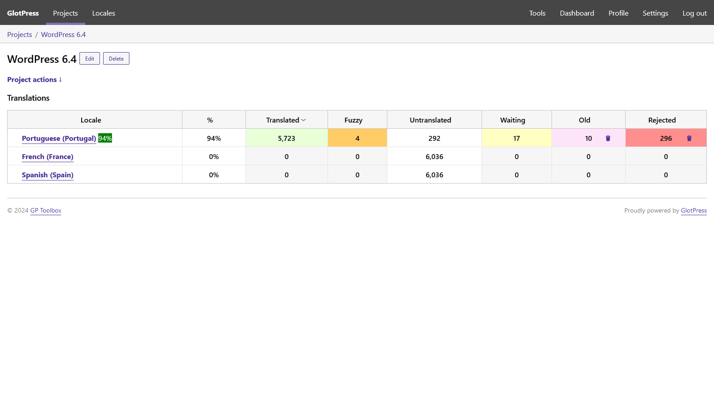
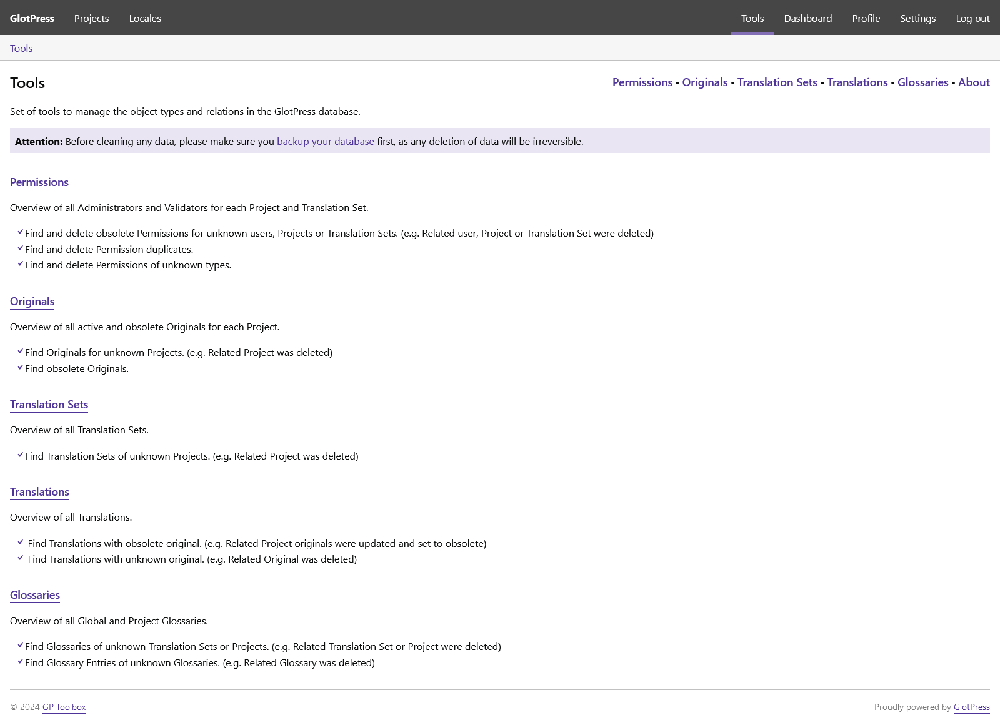
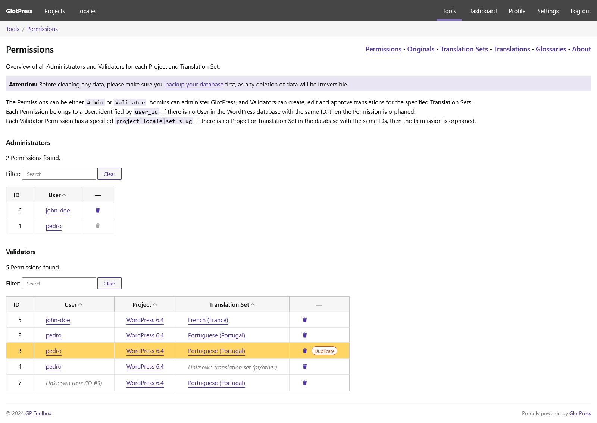
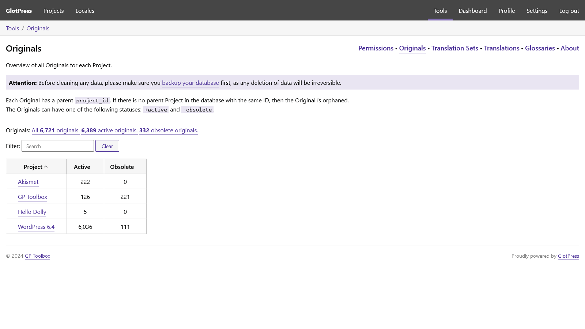
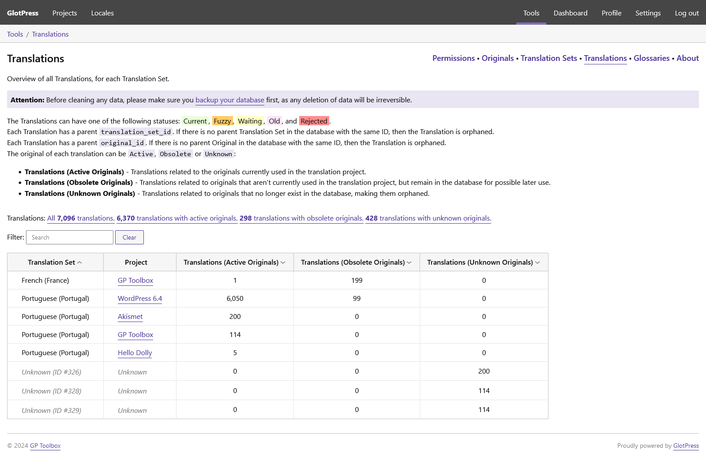
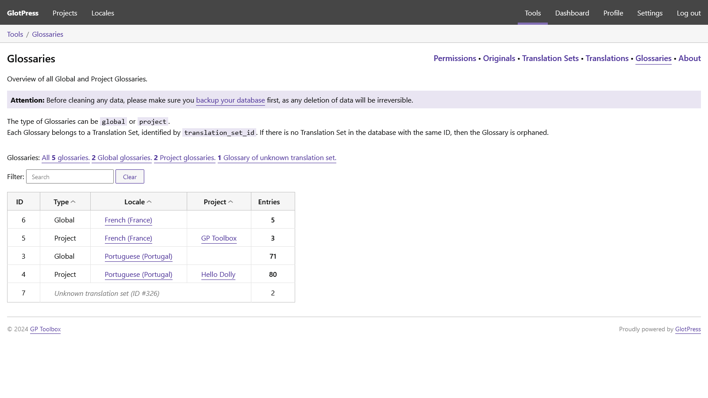

# GP Toolbox

Set of tools to help you manage your GlotPress.

## Description

This set of tools extends the functionality of GlotPress, bringing to light any potential problems hidden under the hood, keeping it clean, fast and trouble-free.

## Features

* WordPress dashboard:
  * Admin menu link to GlotPress menu item.
  * Admin menu link to the Tools page.
* GlotPress menu:
  * Menu item for GlotPress Tools.
  * Menu item for WordPress dashboard.
* GlotPress project page:
  * Adds 'Old' and 'Rejected' columns to the project table of Translation Sets.
  * Button to quickly and permanently delete 'Old' and 'Rejected' translations.
* Tools:
  * Permissions - Overview of Admins and Validators, quick delete, duplicates check.
  * Originals - Overview of all Originals for each Project.
  * Glossaries - Overview of Global Glossaries, Project Glossaries and Glossary entries.
  * Translation Sets - Overview of all Translation Sets.
  * Translations - Overview of all Translations, for each Translation Set.

## Requirements

* GlotPress v3.0.

## Frequently Asked Questions

### Can I contribute to this plugin?

Sure! You are welcome to report any issues or add feature suggestions on the [GitHub repository](https://github.com/pedro-mendonca/GP-Toolbox).

## Screenshots

1. Project page with added 'Old' and 'Rejected' columns, with delete buttons

   

2. Tools

   

3. Tools > Permissions

   

4. Tools > Originals

   

5. Tools > Translation Set

   

6. Tools > Translations

   

7. Tools > Glossaries

   

## Changelog

### Unreleased

* Remove link in current breadcrumb item.
* Link translations with active originals.
* Filter translations by unknown translation sets.
* Show originals filters only for existent cases.
* CSS fixes.

### 1.0.2

* Add confirmation before delete items.

### 1.0.1

* Fix Glossaries tools sorting and improve filtering.
* Improve Glossaries tools filters.

### 1.0.0

* Initial release.
* Add columns for Old and Rejected translations in GlotPress Project page.
* Tools overview page.
* Permissions tools page.
* Originals tools page.
* Glossary tools page.
* Translation Sets tools page.
* Translations tools page.
* WordPress dashboard menu items.
* GlotPress menu items.
